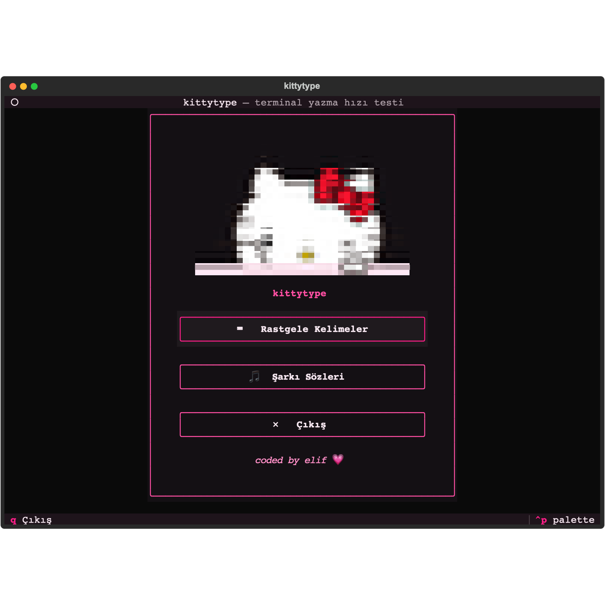
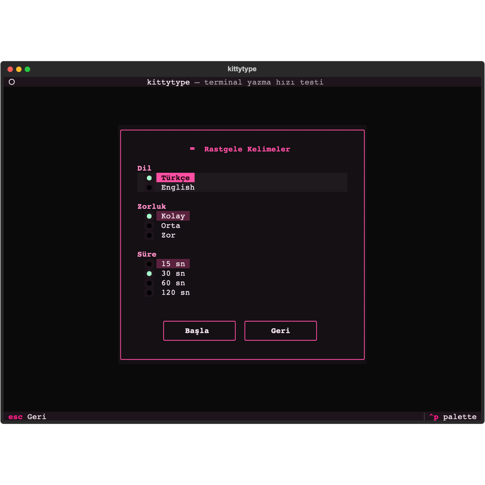
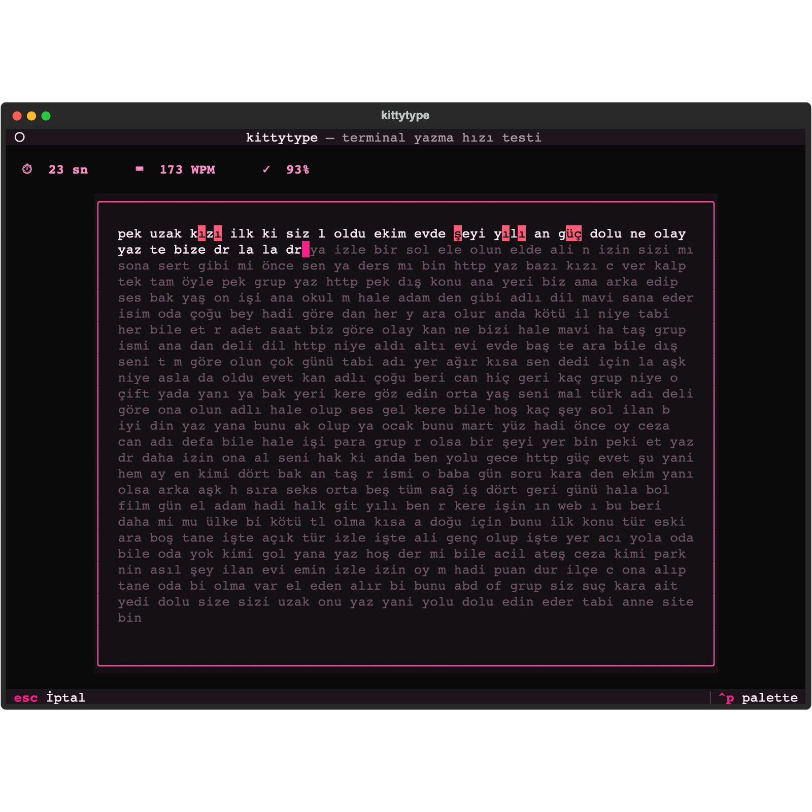
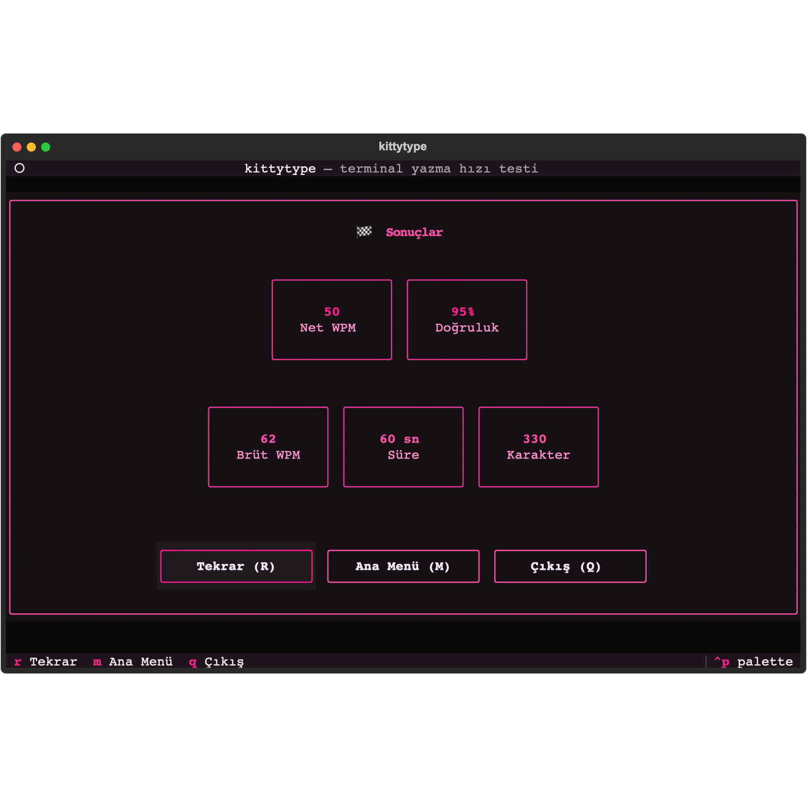
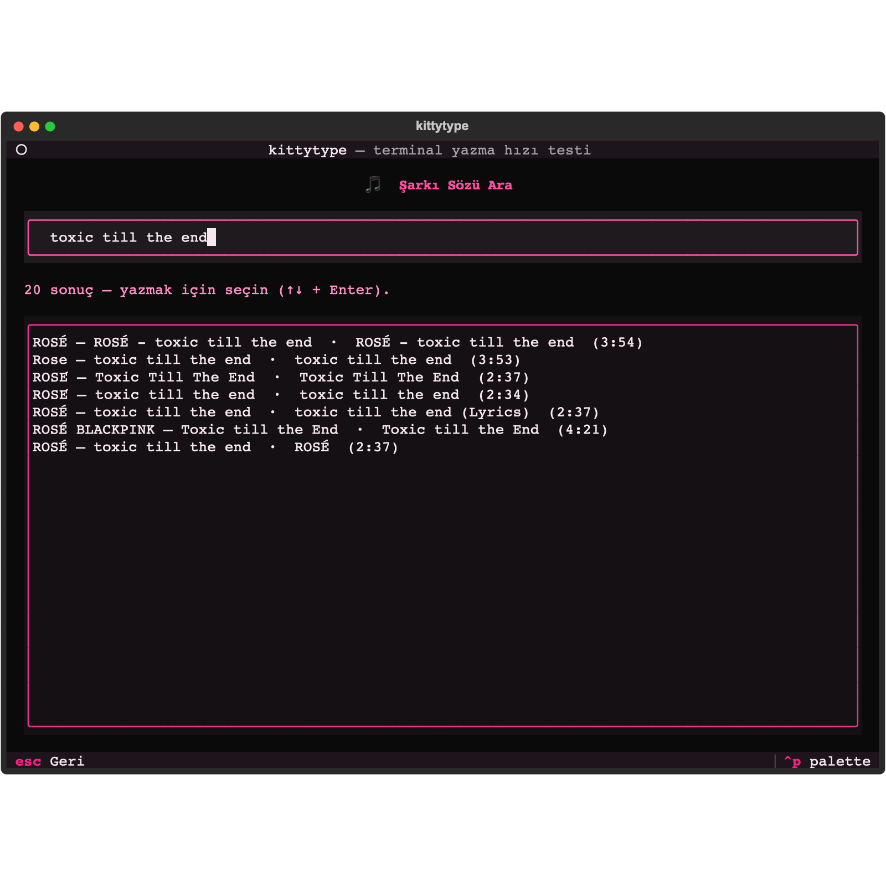
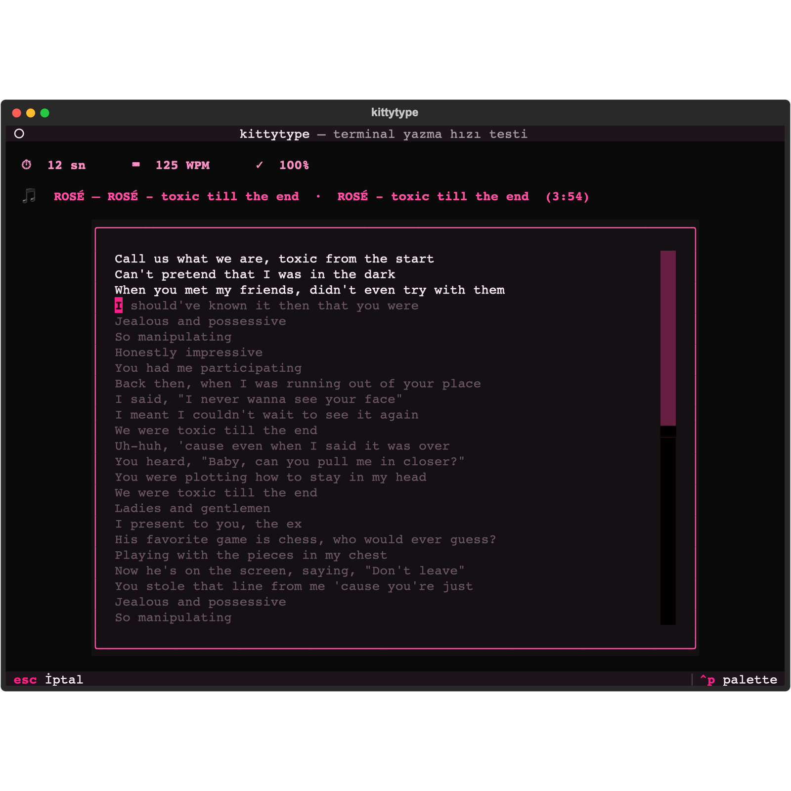

<p align="center">
  
</p>

<h1 align="center">kittytype</h1>

<p align="center">
  A black &amp; pink <b>terminal typing-speed test</b> — with a song-lyrics mode and an animated Hello Kitty.<br>
  <em>Siyah-pembe temalı <b>terminal yazma hızı testi</b> — şarkı sözü modu ve animasyonlu Hello Kitty ile.</em>
</p>

<p align="center">
  
  
  
  
</p>

<p align="center">
  <b><a href="#english">English</a> &nbsp;·&nbsp; <a href="#türkçe">Türkçe</a></b>
</p>

---

## Screenshots / Ekran Görüntüleri

<table>
  <tr>
    <td align="center"><br><sub><b>Main menu</b> / Ana menü</sub></td>
    <td align="center"><br><sub><b>Options</b> / Ayarlar</sub></td>
  </tr>
  <tr>
    <td align="center"><br><sub><b>Random words</b> / Rastgele kelimeler</sub></td>
    <td align="center"><br><sub><b>Results</b> / Sonuçlar</sub></td>
  </tr>
  <tr>
    <td align="center"><br><sub><b>Song search</b> / Şarkı arama</sub></td>
    <td align="center"><br><sub><b>Lyrics mode</b> / Şarkı sözü modu</sub></td>
  </tr>
</table>

---

## English

### What is kittytype?

**kittytype** is a typing-speed test that runs entirely in your terminal. Beyond the classic experience (live WPM, accuracy, timed tests, difficulty levels) it has one standout feature: **search for a song, pull its lyrics, and type them.** Plus a cute animated Hello Kitty greeting you on the home screen.

### Features

- **Random Words mode** — timed test (15 / 30 / 60 / 120 s) with live WPM &amp; accuracy.
- **Song Lyrics mode** — search a song via [LRCLIB](https://lrclib.net) (free, no API key), pick a result, and type the real lyrics line by line.
- **Difficulty** (Easy / Medium / Hard) — changes the word pool (short common → long rare words). No punctuation or numbers.
- **Turkish &amp; English** word pools — chosen at start. UI is in Turkish.
- **Black &amp; pink theme** with per-character coloring (correct / incorrect / cursor / pending).
- **Results screen** — Net WPM, Gross WPM, Accuracy %, time, raw characters.
- **Animated Hello Kitty** on the home screen (a real GIF rendered as colored half-blocks — works in any terminal).
- Full **Turkish character** support (ı ğ ş ç ö ü) with correct, case-sensitive matching.

### Requirements

- **Python 3.9+**
- A terminal at least **80x24** (bigger is nicer)
- **Internet** connection — only for Song Lyrics mode

### Installation

```bash
git clone https://github.com/codedbyelif/tui-kittytype.git
cd tui-kittytype

python3 -m venv .venv
source .venv/bin/activate         # Windows: .venv\Scripts\activate

pip install -e .
```

> Using a virtual environment keeps your system Python clean. Word lists and the Hello Kitty GIF are bundled — no extra setup needed.

### Running

```bash
kittytype
# or
python -m kittytype
```

### Controls

| Key | Action |
| --- | --- |
| *(any letter)* | Start the test on your **first keystroke** |
| `Backspace` | Delete / correct |
| `Space` or `Enter` | In lyrics mode, advance to the next line |
| `Esc` | Go back / cancel a test |
| `R` / `M` / `Q` | On results: **R**etry, **M**enu, **Q**uit |
| `Up` / `Down` + `Enter` | Navigate lists (menu, song results) |
| `Ctrl+C` | Quit anywhere |
| `Ctrl+P` | Command palette (theme, etc.) |

### Modes

**Random Words** — Pick language, difficulty, and a duration, then hit *Başla* (Start). A stream of words appears; the timer starts on your first keystroke and the test ends when time runs out.

**Song Lyrics** — Type a song or artist and press `Enter`. Results come from LRCLIB; pick one and its lyrics become your typing text, shown **line by line**. Press `Space`/`Enter` at the end of each line.

### Difficulty &amp; Languages

- **Easy** — short, common words. **Medium** — longer common words. **Hard** — longer, rarer words.
- Difficulty only affects the word pool; punctuation and numbers are never added.
- Word pools are available in **Turkish** and **English** (selectable). The menus are in Turkish.

### Development

```bash
pip install -e ".[dev]"          # adds wordfreq, pytest, ruff
pytest                           # core logic tests
ruff check src/                  # lint
python scripts/generate_wordlists.py   # regenerate word lists (optional)
```

**Project structure**

```
src/kittytype/
├── app.py             # App, theme, screen setup, `main()` entry point
├── config.py          # Language / Difficulty / durations / TestConfig
├── theme.py           # black+pink Theme + per-char styles
├── styles/            # Textual CSS (.tcss)
├── core/              # stats (WPM), engine (typing state), text_source
├── lyrics/            # LRCLIB async client + model
├── widgets/           # typing_area, live_stats, gif_cat (animated GIF)
├── screens/           # main_menu, options, song_search, typing, results
└── data/              # bundled word lists + hello-kitty.gif
scripts/generate_wordlists.py   # build-time word-list generator (wordfreq)
```

### How it works

- Built with **[Textual](https://textual.textualize.io/)** (Python TUI framework) — CSS-like theming, async workers, key handling.
- The **GIF** is decoded with **Pillow**; each frame becomes colored half-block (`▀`) characters, so it animates in any terminal without special protocols.
- **WPM** = (typed chars / 5) / minutes. **Net WPM** subtracts uncorrected errors. **Accuracy** = correct / total keystrokes.
- Turkish text is **NFC-normalized** and matched case-sensitively (Turkish casing is locale-specific).

### Tech Stack

| Technology | Used for |
| --- | --- |
| [Python 3.9+](https://www.python.org/) | Programming language |
| [Textual](https://textual.textualize.io/) | TUI framework — screens, theming (TCSS), async workers, key events |
| [Rich](https://github.com/Textualize/rich) | Text rendering — per-character coloring &amp; half-block GIF frames |
| [httpx](https://www.python-httpx.org/) | Async HTTP client for the LRCLIB API |
| [Pillow](https://python-pillow.org/) | Decoding the GIF into frames |
| [LRCLIB](https://lrclib.net) | Song-lyrics source (free, no API key) |
| [wordfreq](https://pypi.org/project/wordfreq/) | Build-time Turkish/English word-list generation |
| [pytest](https://pytest.org/) · [ruff](https://docs.astral.sh/ruff/) | Tests &amp; linting (dev) |
| [Hatchling](https://hatch.pypa.io/) | Build backend / packaging |

### Assets &amp; Credits

- Coded by **Elif Kaynar** — *coded by elif*.
- Hello Kitty is a character of **© Sanrio**, used here only as a personal/demo asset. Swap in your own animation at `src/kittytype/data/hello-kitty.gif`.
- Lyrics are fetched from **[LRCLIB](https://lrclib.net)** for personal practice only.

### License

[MIT](LICENSE) © 2026 Elif Kaynar

---

## Türkçe

### kittytype nedir?

**kittytype**, tamamen terminalde çalışan bir yazma hızı (typing speed) testidir. Klasik deneyime (canlı WPM, doğruluk, süreli test, zorluk seviyeleri) ek olarak ayırt edici bir özelliği var: **bir şarkı aratıp sözlerini çekip onları yazabilirsin.** Üstelik açılış ekranında seni karşılayan animasyonlu sevimli bir Hello Kitty ile.

### Özellikler

- **Rastgele Kelimeler modu** — süreli test (15 / 30 / 60 / 120 sn), canlı WPM ve doğruluk.
- **Şarkı Sözleri modu** — [LRCLIB](https://lrclib.net) üzerinden (ücretsiz, API anahtarsız) şarkı ara, bir sonuç seç, gerçek sözleri dize dize yaz.
- **Zorluk** (Kolay / Orta / Zor) — kelime havuzunu değiştirir (kısa-yaygın → uzun-nadir). Noktalama/sayı eklenmez.
- **Türkçe ve İngilizce** kelime havuzu — başta seçilir. Arayüz Türkçedir.
- **Siyah-pembe tema** ve karakter karakter renklendirme (doğru / yanlış / imleç / bekleyen).
- **Sonuç ekranı** — Net WPM, Brüt WPM, Doğruluk %, süre, ham karakter.
- Açılışta **animasyonlu Hello Kitty** (gerçek bir GIF, renkli yarım-bloklarla çizilir — her terminalde çalışır).
- Tam **Türkçe karakter** desteği (ı ğ ş ç ö ü), büyük/küçük harfe duyarlı doğru eşleşme.

### Gereksinimler

- **Python 3.9+**
- En az **80x24** bir terminal (daha büyüğü daha iyi)
- **İnternet** bağlantısı — yalnızca Şarkı Sözleri modu için

### Kurulum

```bash
git clone https://github.com/codedbyelif/tui-kittytype.git
cd tui-kittytype

python3 -m venv .venv
source .venv/bin/activate         # Windows: .venv\Scripts\activate

pip install -e .
```

> Sanal ortam (venv) kullanmak sistem Python'unu temiz tutar. Kelime listeleri ve Hello Kitty GIF'i pakete gömülüdür — ek kuruluma gerek yok.

### Çalıştırma

```bash
kittytype
# veya
python -m kittytype
```

### Tuşlar

| Tuş | İşlev |
| --- | --- |
| *(herhangi bir harf)* | Test **ilk tuşa** bastığında başlar |
| `Backspace` | Sil / düzelt |
| `Space` veya `Enter` | Şarkı modunda bir sonraki satıra geç |
| `Esc` | Geri dön / testi iptal et |
| `R` / `M` / `Q` | Sonuçta: **R** tekrar, **M** menü, **Q** çıkış |
| `Yukarı` / `Aşağı` + `Enter` | Listelerde gezin (menü, şarkı sonuçları) |
| `Ctrl+C` | Her yerde çıkış |
| `Ctrl+P` | Komut paleti (tema vb.) |

### Modlar

**Rastgele Kelimeler** — Dil, zorluk ve süre seç, *Başla*'ya bas. Bir kelime akışı gelir; sayaç ilk tuşta başlar, süre dolunca test biter.

**Şarkı Sözleri** — Bir şarkı veya sanatçı yaz ve `Enter`'a bas. Sonuçlar LRCLIB'ten gelir; birini seç, sözleri **dize dize** yazma metnin olur. Her satır sonunda `Space`/`Enter` ile geç.

### Zorluk ve Diller

- **Kolay** — kısa, yaygın kelimeler. **Orta** — daha uzun yaygın kelimeler. **Zor** — daha uzun, daha nadir kelimeler.
- Zorluk yalnızca kelime havuzunu etkiler; noktalama ve sayı asla eklenmez.
- Kelime havuzları **Türkçe** ve **İngilizce** olarak mevcuttur (seçilebilir). Menüler Türkçedir.

### Geliştirme

```bash
pip install -e ".[dev]"          # wordfreq, pytest, ruff ekler
pytest                           # çekirdek mantık testleri
ruff check src/                  # lint
python scripts/generate_wordlists.py   # kelime listelerini yeniden üret (opsiyonel)
```

**Proje yapısı**

```
src/kittytype/
├── app.py             # Uygulama, tema, ekran kurulumu, `main()` giriş noktası
├── config.py          # Dil / Zorluk / süreler / TestConfig
├── theme.py           # siyah+pembe Tema + karakter stilleri
├── styles/            # Textual CSS (.tcss)
├── core/              # stats (WPM), engine (yazma durumu), text_source
├── lyrics/            # LRCLIB async istemci + model
├── widgets/           # typing_area, live_stats, gif_cat (animasyonlu GIF)
├── screens/           # main_menu, options, song_search, typing, results
└── data/              # gömülü kelime listeleri + hello-kitty.gif
scripts/generate_wordlists.py   # derleme-zamanı kelime üretici (wordfreq)
```

### Nasıl çalışır

- **[Textual](https://textual.textualize.io/)** (Python TUI çatısı) ile yazıldı — CSS benzeri tema, async worker'lar, tuş yönetimi.
- **GIF**, **Pillow** ile çözülür; her kare renkli yarım-blok (`▀`) karakterlere dönüşür, böylece özel protokol gerekmeden her terminalde oynar.
- **WPM** = (yazılan karakter / 5) / dakika. **Net WPM** düzeltilmemiş hataları çıkarır. **Doğruluk** = doğru / toplam tuş.
- Türkçe metin **NFC normalize** edilir ve büyük/küçük harfe duyarlı eşleştirilir (Türkçe casing yerele özgüdür).

### Teknolojiler

| Teknoloji | Ne için |
| --- | --- |
| [Python 3.9+](https://www.python.org/) | Programlama dili |
| [Textual](https://textual.textualize.io/) | TUI çatısı — ekranlar, tema (TCSS), async worker'lar, tuş olayları |
| [Rich](https://github.com/Textualize/rich) | Metin render — karakter karakter renklendirme ve yarım-blok GIF kareleri |
| [httpx](https://www.python-httpx.org/) | LRCLIB API için async HTTP istemcisi |
| [Pillow](https://python-pillow.org/) | GIF'i karelere çözmek |
| [LRCLIB](https://lrclib.net) | Şarkı sözü kaynağı (ücretsiz, API anahtarsız) |
| [wordfreq](https://pypi.org/project/wordfreq/) | Derleme-zamanı Türkçe/İngilizce kelime listesi üretimi |
| [pytest](https://pytest.org/) · [ruff](https://docs.astral.sh/ruff/) | Test ve lint (geliştirme) |
| [Hatchling](https://hatch.pypa.io/) | Derleme arka ucu / paketleme |

### Varlıklar ve Emeği Geçen

- Kodlayan: **Elif Kaynar** — *coded by elif*.
- Hello Kitty, **© Sanrio**'nun bir karakteridir; burada yalnızca kişisel/demo amaçlı kullanılmıştır. Kendi animasyonunu `src/kittytype/data/hello-kitty.gif` ile değiştirebilirsin.
- Sözler **[LRCLIB](https://lrclib.net)**'ten yalnızca kişisel pratik amacıyla çekilir.

### Lisans

[MIT](LICENSE) © 2026 Elif Kaynar
